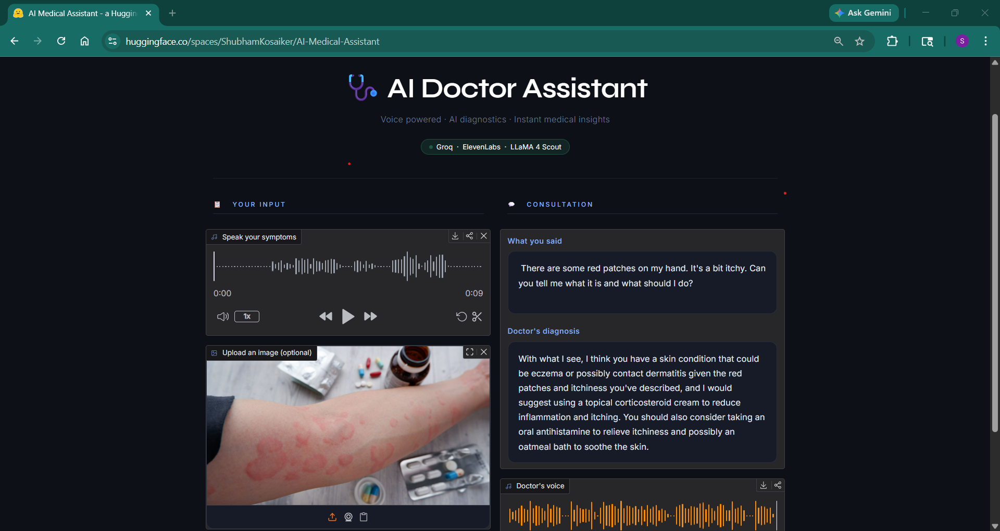

# 🩺 AI Medical Assistant Chatbot

> **Multimodal AI doctor** — speak your symptoms, upload a photo, and receive a spoken diagnosis powered by LLaMA 4 Scout, Whisper, and Google TTS.

[](https://github.com/ShubhamKosaiker/AI-Medical-Assistant-Chatbot/actions/workflows/ci.yml)


---

## 🎥 Live Demo

👉 **[Try it live on HuggingFace](https://huggingface.co/spaces/ShubhamKosaiker/AI-Medical-Assistant)**



> ⚠️ **For educational purposes only.** Not a substitute for professional medical advice.

---

## Architecture

```
┌─────────────────────────────────────────────────────────┐
│                    Gradio Web UI                         │
│         (browser microphone + image upload)              │
└──────────────┬────────────────────────┬─────────────────┘
               │ audio file             │ image file
               ▼                        ▼
┌──────────────────────┐   ┌────────────────────────────┐
│  voice_of_patient.py │   │   brain_of_the_doctor.py   │
│                      │   │                            │
│  Groq Whisper        │   │  encode_image() → base64   │
│  (whisper-large-v3)  │   │                            │
│  Speech → Text       │   │  Groq LLaMA 4 Scout 17B    │
│                      │   │  Image + Text → Diagnosis  │
│  [retry: 3 attempts] │   │  [retry: 3 attempts]       │
└──────────┬───────────┘   └──────────┬─────────────────┘
           │ transcription            │ diagnosis text
           └──────────────────────────┘
                          │
                          ▼
            ┌─────────────────────────┐
            │   voice_of_doctor.py    │
            │                         │
            │  gTTS (Google TTS)      │  ← default (free)
            │  ElevenLabs (optional)  │  ← premium voice
            │  Text → MP3 audio       │
            └────────────┬────────────┘
                         │ audio file
                         ▼
            ┌─────────────────────────┐
            │   Gradio UI outputs     │
            │  • Transcription text   │
            │  • Diagnosis text       │
            │  • Audio playback       │
            │  • Session history      │
            └─────────────────────────┘
```

---

## Tech Stack

| Layer | Technology | Purpose |
|-------|-----------|---------|
| UI | [Gradio 6](https://gradio.app) | Web interface, audio recording, image upload |
| Speech-to-Text | [Groq Whisper large-v3](https://groq.com) | Fast, accurate transcription |
| Vision + LLM | [LLaMA 4 Scout 17B](https://groq.com) via Groq | Multimodal diagnosis generation |
| Text-to-Speech | [gTTS](https://pypi.org/project/gTTS/) / [ElevenLabs](https://elevenlabs.io) | Spoken response |
| Resilience | [Tenacity](https://tenacity.readthedocs.io) | Automatic retry on API failures |
| Testing | [pytest](https://pytest.org) + pytest-mock | 35 unit tests, all mocked |
| Containerisation | Docker + docker-compose | Reproducible deployment |
| CI | GitHub Actions | Auto-run tests on every push |

---

## Features

- 🎙️ **Voice input** — record symptoms directly in the browser
- 🖼️ **Image analysis** — upload photos of skin conditions, wounds, rashes, etc.
- 🔊 **Spoken response** — AI doctor replies in natural speech
- 💬 **Session history** — full conversation log persists across consultations
- 🔁 **Auto-retry** — 3-attempt exponential backoff on all Groq API calls
- 🛡️ **Input validation** — image type and size checked before API call
- 🐳 **Docker-ready** — one command to run anywhere
- ✅ **35 tests** — full unit test suite, no real API calls needed

---

## Quick Start

### Prerequisites

- Python 3.11
- [Pipenv](https://pipenv.pypa.io/en/latest/)
- [FFmpeg](https://ffmpeg.org/download.html) on your PATH
- A [Groq API key](https://console.groq.com) (free tier works)

### 1 — Clone and install

```bash
git clone https://github.com/ShubhamKosaiker/AI-Medical-Assistant-Chatbot.git
cd AI-Medical-Assistant-Chatbot
pipenv install
```

### 2 — Configure environment

```bash
cp "- Copy.env" .env
# Edit .env and fill in your keys:
#   GROQ_API_KEY=gsk_xxxxxxxxxxxxxxxxxxxx
#   ELEVENLABS_API_KEY=sk_xxxx   (optional — only for premium voice)
```

### 3 — Run

```bash
pipenv run python app.py
# Open http://localhost:7860
```

---

## Run with Docker

```bash
docker compose up --build
# Open http://localhost:7860
```

---

## Run Tests

```bash
pipenv run pytest tests/ -v
```

Expected output:
```
======================== 35 passed in ~6s ========================
```

No API keys required — all external calls are mocked.

---

## Project Structure

```
AI_Medical_Assistant_Chatbot/
│
├── app.py                    # Gradio UI + main processing pipeline
├── config.py                 # All constants: models, limits, system prompt
├── brain_of_the_doctor.py    # Image encoding + LLaMA 4 vision/LLM analysis
├── voice_of_the_patient.py   # FFmpeg setup + Whisper speech-to-text
├── voice_of_the_doctor.py    # gTTS / ElevenLabs text-to-speech
│
├── tests/
│   ├── conftest.py                    # Shared fixtures, env setup
│   ├── test_app.py                    # Pipeline integration tests (14)
│   ├── test_brain_of_the_doctor.py    # Image + LLM tests (9)
│   ├── test_voice_of_the_patient.py   # STT tests (5)
│   └── test_voice_of_the_doctor.py    # TTS tests (7)
│
├── Dockerfile                # Python 3.11-slim + FFmpeg + non-root user
├── docker-compose.yml        # Single-command local deployment
├── .github/workflows/ci.yml  # GitHub Actions CI pipeline
├── requirements.txt          # Python dependencies
└── Pipfile                   # Pipenv dependency spec
```

---

## Configuration

All tuneable values live in [`config.py`](config.py):

| Constant | Default | Description |
|----------|---------|-------------|
| `VISION_MODEL` | `llama-4-scout-17b-16e-instruct` | LLM used for diagnosis |
| `STT_MODEL` | `whisper-large-v3` | Whisper variant for transcription |
| `MAX_IMAGE_SIZE_MB` | `10` | Upload size limit |
| `MAX_TRANSCRIPTION_CHARS` | `2000` | Truncation limit for long audio |
| `API_TIMEOUT_SECONDS` | `30` | Per-request API timeout |
| `SYSTEM_PROMPT` | *(see config.py)* | Doctor persona instructions |

---

## API Cost Reference

| Operation | Model | Typical latency | Cost |
|-----------|-------|----------------|------|
| Speech-to-text | Whisper large-v3 | ~1–2 s | ✅ Groq free tier |
| Vision + diagnosis | LLaMA 4 Scout 17B | ~2–4 s | ✅ Groq free tier |
| Text-to-speech | gTTS (Google) | ~1 s | ✅ Free |
| Text-to-speech | ElevenLabs | ~1–2 s | 💳 Paid tier |

---

## Disclaimer

This project is built for **educational purposes** to demonstrate multimodal AI integration. It is **not** a medical device and should **never** be used as a substitute for consultation with a qualified healthcare professional.

---

## Built By

**Shubham Kosaiker** — [LinkedIn](https://www.linkedin.com/in/shubham-kosaiker-31054321b) · [GitHub](https://github.com/ShubhamKosaiker)
